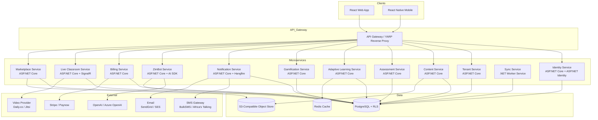

# Design Document: EduZim eLearning Platform

## Overview

EduZim is a Zimbabwe-focused eLearning platform serving two tiers:

- **Pre-school Tier** (ages 2–5): A consumer product subscribed to by parents, delivering foundational learning through 3D animations, audio, games, and AI tutoring.
- **School Tier** (ECD Grade 0 – Grade 7): A multi-tenant B2B product where each subscribing school operates in a fully isolated data environment, with teachers, students, parents, and admins all scoped to their tenant.

The backend is built on **ASP.NET Core (.NET 8+)** using a microservices architecture. The frontend is **React** (web) and **React Native** (mobile). Real-time features use **SignalR**. Background processing uses **Hangfire** and **.NET Worker Services**. Data is stored in **PostgreSQL** with Row-Level Security (RLS) enforcing multi-tenant isolation. **Entity Framework Core** is the ORM. **Redis** provides distributed caching. **S3-compatible object storage** (e.g., MinIO or AWS S3) holds media assets.

---

## Architecture

### High-Level Architecture




### Service Communication

- **Client → Gateway**: HTTPS/REST + WebSocket (SignalR)
- **Gateway → Services**: HTTP/REST internally (YARP reverse proxy)
- **Service → Service (sync)**: gRPC for low-latency inter-service calls (e.g., Assessment Service calling Gamification Service after submission)
- **Service → Service (async)**: MassTransit + RabbitMQ for event-driven messaging (e.g., `ModuleCompleted` event triggers Gamification, Notification, and Adaptive Learning services)
- **Background Jobs**: Hangfire (persistent, database-backed) for scheduled tasks; .NET Worker Services for long-running background processes (Sync Service)

### Multi-Tenancy Strategy

PostgreSQL Row-Level Security (RLS) is the primary enforcement layer. Every table in the school tier has a `tenant_id` column. A `SET app.current_tenant_id = '{tenantId}'` session variable is set on every database connection, and RLS policies filter all reads and writes to that tenant. The application layer also validates tenant claims on every request as a defence-in-depth measure.

```mermaid
sequenceDiagram
    participant Client
    participant Gateway
    participant Service
    participant EFCore as EF Core
    participant PG as PostgreSQL (RLS)

    Client->>Gateway: Request + JWT
    Gateway->>Service: Forward + validate JWT
    Service->>Service: Extract tenant_id from JWT claims
    Service->>EFCore: Query with tenant_id in DbContext
    EFCore->>PG: SET app.current_tenant_id; SELECT ...
    PG->>PG: RLS policy filters rows
    PG-->>EFCore: Tenant-scoped results
    EFCore-->>Service: Typed entities
    Service-->>Client: Response
```

---

## Components and Interfaces

### 1. Identity Service

Handles authentication, authorisation, and user lifecycle.

**Technology**: ASP.NET Core + ASP.NET Identity + OpenIddict (OAuth 2.0 / OIDC server)

**Key Endpoints**:
- `POST /auth/register` — parent or school admin registration
- `POST /auth/login` — credential-based login, returns JWT + refresh token
- `POST /auth/refresh` — exchange refresh token for new JWT
- `POST /auth/logout` — revoke refresh token
- `POST /auth/verify-email` — email verification
- `POST /auth/sso/{tenantId}` — SSO redirect for tenant IdP
- `POST /auth/2fa/verify` — two-factor authentication verification

**Key Interfaces**:
```csharp
public interface IIdentityService
{
    Task<AuthResult> RegisterAsync(RegisterRequest request);
    Task<AuthResult> LoginAsync(LoginRequest request);
    Task<AuthResult> RefreshTokenAsync(string refreshToken);
    Task RevokeTokenAsync(string refreshToken);
    Task<bool> VerifyEmailAsync(string userId, string token);
    Task LockAccountAsync(string userId, TimeSpan duration);
    Task<bool> ValidateTwoFactorAsync(string userId, string code);
}
```

### 2. Tenant Service

Manages tenant provisioning, branding, and school admin operations.

**Technology**: ASP.NET Core minimal API

**Key Endpoints**:
- `POST /tenants` — create new tenant (Platform Admin only)
- `GET /tenants/{tenantId}` — get tenant details
- `PUT /tenants/{tenantId}/branding` — update logo, name, colour scheme
- `GET /tenants/{tenantId}/dashboard` — admin dashboard metrics
- `POST /tenants/{tenantId}/invite-codes` — generate student/parent invite codes

**Key Interfaces**:
```csharp
public interface ITenantService
{
    Task<Tenant> ProvisionTenantAsync(CreateTenantRequest request);
    Task<TenantDashboard> GetDashboardAsync(Guid tenantId);
    Task UpdateBrandingAsync(Guid tenantId, BrandingSettings branding);
    Task<InviteCode> GenerateInviteCodeAsync(Guid tenantId, InviteCodeType type);
    Task SuspendTenantAsync(Guid tenantId);
    Task RestoreTenantAsync(Guid tenantId);
}
```

### 3. Content Service

Manages all learning content: upload, storage, retrieval, and lifecycle.

**Technology**: ASP.NET Core + EF Core + S3 SDK (AWSSDK.S3 or Minio)

**Key Endpoints**:
- `POST /content/upload` — multipart upload for video/PDF/audio
- `GET /content/{contentId}` — retrieve content metadata + signed URL
- `POST /modules` — create module
- `GET /modules/{moduleId}` — get module with ordered content items
- `DELETE /content/{contentId}` — soft-delete (archived for 30 days)
- `GET /content/{contentId}/captions` — retrieve closed captions

**Key Interfaces**:
```csharp
public interface IContentService
{
    Task<ContentItem> UploadAsync(UploadRequest request, Stream fileStream);
    Task<Module> CreateModuleAsync(CreateModuleRequest request);
    Task<IReadOnlyList<ContentItem>> GetModuleContentAsync(Guid moduleId);
    Task ArchiveContentAsync(Guid contentId);
    Task<string> GetSignedUrlAsync(Guid contentId, TimeSpan expiry);
}
```

### 4. Assessment Service

Handles quiz/test creation, assignment, submission, and auto-grading.

**Technology**: ASP.NET Core + EF Core

**Key Endpoints**:
- `POST /assessments` — create assessment with questions
- `POST /assessments/{id}/assign` — assign to class
- `POST /assessments/{id}/submit` — student submits answers
- `GET /assessments/{id}/results/{studentId}` — get result with feedback
- `GET /assessments/{id}/class-results` — teacher view of all results

**Key Interfaces**:
```csharp
public interface IAssessmentService
{
    Task<Assessment> CreateAsync(CreateAssessmentRequest request);
    Task AssignToClassAsync(Guid assessmentId, Guid classId);
    Task<AssessmentResult> SubmitAsync(Guid assessmentId, Guid studentId, IReadOnlyList<Answer> answers);
    Task<ClassResults> GetClassResultsAsync(Guid assessmentId);
}
```

### 5. Adaptive Learning Service

Analyses student performance and generates personalised learning path recommendations.

**Technology**: ASP.NET Core + EF Core + Redis (caching learning profiles)

**Key Endpoints**:
- `GET /adaptive/{studentId}/path` — get current recommended learning path
- `GET /adaptive/{studentId}/summary` — weekly summary
- `POST /adaptive/{studentId}/update` — trigger profile update after module completion

**Key Interfaces**:
```csharp
public interface IAdaptiveLearningService
{
    Task UpdateLearningProfileAsync(Guid studentId, ModuleCompletionData data);
    Task<LearningPath> GetRecommendedPathAsync(Guid studentId);
    Task<WeeklySummary> GenerateWeeklySummaryAsync(Guid studentId);
    Task<DifficultyLevel> GetAdjustedDifficultyAsync(Guid studentId, Guid topicId);
}
```

### 6. Gamification Service

Awards points, badges, and manages leaderboards.

**Technology**: ASP.NET Core + EF Core

**Key Endpoints**:
- `GET /gamification/{studentId}/points` — current points total
- `GET /gamification/{studentId}/badges` — earned badges
- `GET /gamification/leaderboard/{tenantId}` — tenant-scoped leaderboard
- `POST /gamification/award` — internal gRPC endpoint called by other services

**Key Interfaces**:
```csharp
public interface IGamificationService
{
    Task<PointsAward> AwardPointsAsync(Guid studentId, AwardReason reason, int basePoints, double? bonusMultiplier);
    Task<Badge> CheckAndAwardBadgesAsync(Guid studentId, MilestoneEvent milestoneEvent);
    Task<IReadOnlyList<LeaderboardEntry>> GetLeaderboardAsync(Guid tenantId, int topN);
}
```

### 7. Notification Service

Routes notifications across in-app, email, and SMS channels.

**Technology**: ASP.NET Core + Hangfire (scheduled/retry jobs) + SendGrid + Africa's Talking SMS

**Key Endpoints**:
- `POST /notifications/send` — internal endpoint to queue a notification
- `GET /notifications/{userId}` — get user's in-app notifications
- `PUT /notifications/{id}/read` — mark as read
- `PUT /users/{userId}/notification-preferences` — update preferences

**Key Interfaces**:
```csharp
public interface INotificationService
{
    Task QueueNotificationAsync(NotificationRequest request);
    Task<IReadOnlyList<Notification>> GetInAppNotificationsAsync(Guid userId);
    Task UpdatePreferencesAsync(Guid userId, NotificationPreferences preferences);
}

public interface ISmsService
{
    Task<SmsResult> SendAsync(string phoneNumber, string message);
}
```

### 8. ZimBot Service

Wraps the AI provider and manages conversational tutoring sessions.

**Technology**: ASP.NET Core + Azure OpenAI SDK / Semantic Kernel

**Key Endpoints**:
- `POST /zimbot/chat` — send a message, receive a response
- `GET /zimbot/logs/{tenantId}` — teacher view of interaction logs (tenant-scoped)

**Key Interfaces**:
```csharp
public interface IZimBotService
{
    Task<ZimBotResponse> ChatAsync(ZimBotRequest request);
    Task<IReadOnlyList<ZimBotInteraction>> GetLogsAsync(Guid tenantId, Guid? studentId);
}
```

### 9. Billing Service

Manages subscriptions, payment processing, and invoice generation.

**Technology**: ASP.NET Core + Stripe.net / Paynow SDK + Hangfire (renewal reminders)

**Key Endpoints**:
- `POST /billing/subscriptions` — create subscription
- `POST /billing/webhooks/stripe` — Stripe webhook handler
- `GET /billing/invoices/{subscriptionId}` — list invoices
- `GET /billing/invoices/{invoiceId}/download` — download PDF invoice

**Key Interfaces**:
```csharp
public interface IBillingService
{
    Task<Subscription> CreateSubscriptionAsync(CreateSubscriptionRequest request);
    Task HandlePaymentSucceededAsync(string paymentIntentId);
    Task HandlePaymentFailedAsync(string paymentIntentId);
    Task<Invoice> GenerateInvoiceAsync(Guid subscriptionId, Guid paymentId);
    Task<decimal> CalculateSchoolFeeAsync(int studentCount, BillingCycle cycle);
}
```

### 10. Live Classroom Service

Manages scheduling, real-time sessions, attendance, and recordings.

**Technology**: ASP.NET Core + SignalR (presence/signalling) + Daily.co or Jitsi (video)

**Key Endpoints**:
- `POST /classrooms` — schedule a session
- `GET /classrooms/{id}/join` — get join token
- `POST /classrooms/{id}/end` — end session, trigger attendance + recording
- `GET /classrooms/{id}/attendance` — get attendance record
- `GET /classrooms/{id}/recording` — get recording URL (within 30-day window)

**Key Interfaces**:
```csharp
public interface ILiveClassroomService
{
    Task<ClassroomSession> ScheduleAsync(ScheduleSessionRequest request);
    Task<JoinToken> GetJoinTokenAsync(Guid sessionId, Guid userId);
    Task<AttendanceRecord> EndSessionAsync(Guid sessionId);
    Task<string?> GetRecordingUrlAsync(Guid sessionId);
}
```

### 11. Sync Service

Reconciles offline progress data with the server.

**Technology**: .NET Worker Service + EF Core + MassTransit

**Key Interfaces**:
```csharp
public interface ISyncService
{
    Task ProcessOfflineQueueAsync(Guid studentId, IReadOnlyList<OfflineProgressItem> items);
    Task<SyncConflict?> DetectConflictAsync(OfflineProgressItem local, ProgressRecord server);
    Task ResolveConflictAsync(SyncConflict conflict, ConflictResolutionStrategy strategy);
}
```

### 12. Marketplace Service

Manages content pack publishing, discovery, approval, and cross-tenant sharing.

**Technology**: ASP.NET Core + EF Core

**Key Endpoints**:
- `POST /marketplace/packs` — submit content pack for review
- `GET /marketplace/packs` — browse approved packs
- `POST /marketplace/packs/{id}/request-access` — request access from another tenant
- `POST /marketplace/packs/{id}/approve-access` — originating teacher approves
- `POST /marketplace/packs/{id}/rate` — submit rating/review
- `DELETE /marketplace/packs/{id}` — Platform Admin removes violating pack

---


## Data Models

### Core Entities

```csharp
// Multi-tenancy base
public abstract class TenantEntity
{
    public Guid Id { get; set; }
    public Guid TenantId { get; set; }
    public DateTime CreatedAt { get; set; }
    public DateTime UpdatedAt { get; set; }
}

// Identity
public class ApplicationUser : IdentityUser<Guid>
{
    public Guid? TenantId { get; set; }
    public UserRole Role { get; set; }
    public string? PreferredLanguage { get; set; }
    public bool IsEmailVerified { get; set; }
    public int FailedLoginAttempts { get; set; }
    public DateTime? LockoutEnd { get; set; }
}

public enum UserRole { Student, Teacher, ParentGuardian, SchoolAdmin, PlatformAdmin }

// Tenant
public class Tenant
{
    public Guid Id { get; set; }
    public string Name { get; set; } = default!;
    public TenantTier Tier { get; set; }
    public TenantStatus Status { get; set; }
    public BrandingSettings Branding { get; set; } = default!;
    public DateTime CreatedAt { get; set; }
}

public enum TenantTier { PreSchool, School }
public enum TenantStatus { Active, Suspended, Provisioning }

public class BrandingSettings
{
    public string? LogoUrl { get; set; }
    public string SchoolName { get; set; } = default!;
    public string PrimaryColour { get; set; } = "#1976D2";
}

// Subscription
public class Subscription
{
    public Guid Id { get; set; }
    public Guid TenantId { get; set; }
    public BillingCycle Cycle { get; set; }
    public SubscriptionStatus Status { get; set; }
    public DateTime CurrentPeriodStart { get; set; }
    public DateTime CurrentPeriodEnd { get; set; }
    public DateTime? GracePeriodEnd { get; set; }
    public int? StudentCount { get; set; }
}

public enum BillingCycle { Monthly, Termly, Yearly }
public enum SubscriptionStatus { Active, GracePeriod, Suspended, Cancelled }

// Content
public class ContentItem : TenantEntity
{
    public string Title { get; set; } = default!;
    public ContentType Type { get; set; }
    public string StorageKey { get; set; } = default!;
    public long FileSizeBytes { get; set; }
    public int? DurationSeconds { get; set; }
    public string Language { get; set; } = "en";
    public ContentStatus Status { get; set; }
    public Guid UploadedByUserId { get; set; }
    public DateTime? ArchivedAt { get; set; }
}

public enum ContentType { Video, Pdf, Audio, Scene3D, Animation, Quiz, Game }
public enum ContentStatus { Draft, Published, Archived }

public class Module : TenantEntity
{
    public string Title { get; set; } = default!;
    public GradeLevel Grade { get; set; }
    public string Subject { get; set; } = default!;
    public int SequenceOrder { get; set; }
    public bool IsRequired { get; set; }
    public ICollection<ModuleContentItem> ContentItems { get; set; } = new List<ModuleContentItem>();
}

public enum GradeLevel { EcdGrade0, EcdGrade1, Grade1, Grade2, Grade3, Grade4, Grade5, Grade6, Grade7 }

// Assessment
public class Assessment : TenantEntity
{
    public string Title { get; set; } = default!;
    public Guid ModuleId { get; set; }
    public int? TimeLimitSeconds { get; set; }
    public int PassingScorePercent { get; set; } = 60;
    public ICollection<Question> Questions { get; set; } = new List<Question>();
}

public class Question
{
    public Guid Id { get; set; }
    public Guid AssessmentId { get; set; }
    public QuestionType Type { get; set; }
    public string Text { get; set; } = default!;
    public ICollection<QuestionOption> Options { get; set; } = new List<QuestionOption>();
    public string? CorrectAnswer { get; set; }
    public int Points { get; set; }
}

public enum QuestionType { MultipleChoice, TrueFalse, ShortAnswer }

public class AssessmentAttempt : TenantEntity
{
    public Guid AssessmentId { get; set; }
    public Guid StudentId { get; set; }
    public int ScorePercent { get; set; }
    public int TimeTakenSeconds { get; set; }
    public DateTime SubmittedAt { get; set; }
    public ICollection<AnswerRecord> Answers { get; set; } = new List<AnswerRecord>();
}

// Progress
public class StudentProgress : TenantEntity
{
    public Guid StudentId { get; set; }
    public Guid ModuleId { get; set; }
    public bool IsCompleted { get; set; }
    public DateTime? CompletedAt { get; set; }
    public int TimeOnTaskSeconds { get; set; }
}

// Gamification
public class StudentPoints : TenantEntity
{
    public Guid StudentId { get; set; }
    public int TotalPoints { get; set; }
}

public class Badge : TenantEntity
{
    public Guid StudentId { get; set; }
    public BadgeType Type { get; set; }
    public DateTime EarnedAt { get; set; }
}

public enum BadgeType { FirstModule, FiveConsecutiveDays, SubjectMastery, GradeCompletion }

// Notifications
public class Notification : TenantEntity
{
    public Guid UserId { get; set; }
    public NotificationType Type { get; set; }
    public string Message { get; set; } = default!;
    public bool IsRead { get; set; }
    public NotificationChannel Channel { get; set; }
    public NotificationStatus Status { get; set; }
    public int RetryCount { get; set; }
}

public enum NotificationType { NewContent, AssessmentDue, BadgeAwarded, LiveClassroomReminder, SubscriptionRenewal, SubscriptionExpiry, InactivityAlert }
public enum NotificationChannel { InApp, Email, Sms }
public enum NotificationStatus { Pending, Delivered, Failed, Undelivered }

// Sync
public class OfflineSyncQueue
{
    public Guid Id { get; set; }
    public Guid StudentId { get; set; }
    public string Payload { get; set; } = default!;
    public DateTime LocalTimestamp { get; set; }
    public SyncStatus Status { get; set; }
}

public enum SyncStatus { Pending, Synced, Conflicted }

// Audit
public class AuditLog
{
    public Guid Id { get; set; }
    public Guid? TenantId { get; set; }
    public Guid UserId { get; set; }
    public string Action { get; set; } = default!;
    public string ResourceType { get; set; } = default!;
    public Guid? ResourceId { get; set; }
    public DateTime Timestamp { get; set; }
    public string? IpAddress { get; set; }
}
```

### Database Schema Notes

- All school-tier tables include `tenant_id UUID NOT NULL` with a PostgreSQL RLS policy: `USING (tenant_id = current_setting('app.current_tenant_id')::uuid)`
- PII fields (email, phone, name) are encrypted at the application layer using `Microsoft.AspNetCore.DataProtection` with AES-256 before storage
- EF Core `DbContext` sets the session variable on every connection open via `SaveChangesAsync` interceptor
- Soft deletes use `ArchivedAt` timestamp; a Hangfire job permanently deletes records where `ArchivedAt < NOW() - INTERVAL '30 days'`

---


## Correctness Properties

*A property is a characteristic or behavior that should hold true across all valid executions of a system — essentially, a formal statement about what the system should do. Properties serve as the bridge between human-readable specifications and machine-verifiable correctness guarantees.*

### Property 1: Cross-Tenant Data Isolation

*For any* API request made by a user authenticated to tenant A, every entity returned in the response must have a `TenantId` equal to tenant A's ID. No request from tenant A should ever return, modify, or reference data belonging to tenant B.

**Validates: Requirements 1.4, 4.7, 7.2, 11.1, 11.3**

### Property 2: Password Storage Never Stores Plaintext

*For any* user registration with any password string P, the value stored in the `PasswordHash` column must not equal P, and two users registering with the same password P must have different stored hash values (due to per-user salting).

**Validates: Requirements 1.8**

### Property 3: Account Lockout Threshold

*For any* user account, submitting exactly 5 consecutive incorrect credential attempts must result in the account being locked. Submitting fewer than 5 consecutive incorrect attempts must not lock the account.

**Validates: Requirements 1.5**

### Property 4: Unverified Accounts Cannot Access Protected Resources

*For any* user account where `IsEmailVerified = false`, all requests to protected API endpoints must be rejected with HTTP 401 or 403.

**Validates: Requirements 1.2**

### Property 5: Subscription Activation on Payment

*For any* payment success event with a valid subscription ID, the subscription's `Status` must transition to `Active` and `CurrentPeriodEnd` must be extended accordingly.

**Validates: Requirements 2.3**

### Property 6: Grace Period on Payment Failure

*For any* payment failure event, the subscription's `Status` must transition to `GracePeriod` (not `Suspended`), and `GracePeriodEnd` must be set to `NOW() + 7 days`.

**Validates: Requirements 2.5**

### Property 7: Subscription Data Preservation

*For any* tenant whose subscription is suspended, all `StudentProgress`, `AssessmentAttempt`, and `Badge` records for that tenant must still exist in the database and must not be deleted for at least 90 days after suspension.

**Validates: Requirements 2.6, 11.6**

### Property 8: Invoice Created for Every Successful Payment

*For any* successful payment event, exactly one `Invoice` record must be created and associated with that payment. The invoice must be retrievable via the billing API.

**Validates: Requirements 2.7**

### Property 9: School Fee Calculation Correctness

*For any* school subscription with N enrolled students and billing cycle C, the calculated total fee must equal `UnitPrice(C) * N`.

**Validates: Requirements 2.8**

### Property 10: Pre-school Video Duration Limit

*For any* content item in the Pre-school Tier with `Type = Video`, its `DurationSeconds` must be less than or equal to 300 (5 minutes).

**Validates: Requirements 3.3**

### Property 11: At Least One Game Per Foundational Concept

*For any* foundational concept category in the Pre-school Tier content catalog, there must exist at least one `ContentItem` with `Type = Game` associated with that concept.

**Validates: Requirements 3.5**

### Property 12: Session Inactivity Pause

*For any* active toddler session, if no interaction events are recorded for 60 consecutive seconds, the session's `Status` must transition to `Paused`.

**Validates: Requirements 3.7**

### Property 13: Module Completion Unlocks Next Module

*For any* student and any module M in a sequence, when the student's `StudentProgress` record for M has `IsCompleted = true`, the next module in the sequence must become accessible to that student.

**Validates: Requirements 4.4**

### Property 14: Progress Percentage Calculation

*For any* student and subject, the displayed progress percentage must equal `(count of completed modules in subject / total modules in subject) * 100`, rounded to the nearest integer.

**Validates: Requirements 4.8**

### Property 15: Remedial Content Recommendation Below 60%

*For any* assessment attempt where `ScorePercent < 60`, the adaptive learning service must include at least one remedial content recommendation for the associated topic in the student's learning path.

**Validates: Requirements 6.2**

### Property 16: Advanced Extension Offer Above 85%

*For any* assessment attempt where `ScorePercent >= 85`, the adaptive learning service must include at least one advanced extension activity recommendation for the associated topic.

**Validates: Requirements 6.3**

### Property 17: No Grade Advancement Without Passing Score

*For any* student, the next grade-level module must not be unlocked unless all required assessments for the current module have at least one attempt with `ScorePercent >= 60`.

**Validates: Requirements 6.6**

### Property 18: File Upload Size Enforcement

*For any* content upload request, files exceeding the type-specific size limit (500 MB for video, 50 MB for audio) must be rejected before storage. Files within the limit must be accepted.

**Validates: Requirements 7.1**

### Property 19: Soft Delete Retention

*For any* content item that has been deleted (soft-deleted), its `Status` must be `Archived` immediately after deletion, and no permanent deletion must occur until `ArchivedAt + 30 days` has elapsed.

**Validates: Requirements 7.4**

### Property 20: Assessment Assignment Notifies All Enrolled Students

*For any* class assignment of an assessment, every student enrolled in that class must have a corresponding `Notification` record of type `AssessmentDue` created.

**Validates: Requirements 7.6**

### Property 21: Marketplace Submission Requires Admin Review

*For any* content pack submitted to the marketplace, its `Status` must be `PendingReview` until a Platform Admin explicitly approves it. No pack with `Status != Approved` must appear in marketplace discovery results.

**Validates: Requirements 8.2**

### Property 22: Cross-Tenant Content Access Requires Approval

*For any* cross-tenant content access request, the requesting tenant must not be able to retrieve the content until the originating teacher's approval is recorded. After approval, only the specific content pack must be accessible — no other data from the originating tenant.

**Validates: Requirements 8.3, 8.4**

### Property 23: Marketplace Attribution Completeness

*For any* content pack returned from the marketplace API, the response must include both `SchoolName` and `TeacherName` attribution fields with non-empty values.

**Validates: Requirements 8.5**

### Property 24: Assessment Attempt Record Completeness

*For any* assessment submission, the resulting `AssessmentAttempt` record must contain `ScorePercent`, `TimeTakenSeconds`, and `SubmittedAt` with non-null values.

**Validates: Requirements 9.1**

### Property 25: Points Awarded on Module and Assessment Completion

*For any* module or assessment completion event, the student's `TotalPoints` must increase by at least the base award amount. For assessment scores >= 85%, the increase must include the bonus multiplier.

**Validates: Requirements 9.3**

### Property 26: Badge Awarded on Milestone Events

*For any* milestone event (first module, 5 consecutive days, subject mastery, grade completion), a corresponding `Badge` record must be created for the student, and a certificate generation job must be queued.

**Validates: Requirements 9.4, 9.6**

### Property 27: Leaderboard Tenant Isolation

*For any* leaderboard query by a user in tenant T, all returned `LeaderboardEntry` records must have `TenantId = T`. No entries from other tenants must appear.

**Validates: Requirements 9.5**

### Property 28: Timed Assessment Auto-Submit

*For any* timed assessment where `TimeLimitSeconds` is set, any submission attempt received after `StartedAt + TimeLimitSeconds` must be rejected or auto-submitted with answers recorded up to the time limit.

**Validates: Requirements 9.8**

### Property 29: Parent Dashboard Data Completeness

*For any* parent/guardian with linked students, the dashboard response must include `CurrentGrade`, `Subjects`, `RecentActivity`, and `OverallProgressPercent` for each linked student.

**Validates: Requirements 10.1**

### Property 30: Parent Invite Code Round Trip

*For any* valid invite code generated for a tenant, linking a parent account using that code must succeed and create a parent-student association. Using an expired or invalid code must fail.

**Validates: Requirements 10.3**

### Property 31: Screen Time Limit Enforcement

*For any* student account with a `DailyScreenTimeLimitSeconds` set, once the student's session time for the day reaches that limit, the session must be paused and further session creation must be blocked until the next day.

**Validates: Requirements 10.5**

### Property 32: Inactivity Notification After 7 Days

*For any* student whose `LastLoginAt` is more than 7 days in the past, a notification of type `InactivityAlert` must be queued for each linked parent/guardian.

**Validates: Requirements 10.6**

### Property 33: Offline Sync Conflict Resolution by Timestamp

*For any* sync conflict between a locally queued `OfflineProgressItem` and a server-side `ProgressRecord` for the same student and module, the record with the later `Timestamp` must be retained, and a `SyncConflict` log entry must be created.

**Validates: Requirements 12.5**

### Property 34: Live Classroom Notification Lead Time

*For any* scheduled live classroom session, notification records for all invited students and their parents must be created with a scheduled delivery time of at least `SessionStartTime - 24 hours`.

**Validates: Requirements 13.2**

### Property 35: Attendance Record on Session End

*For any* live classroom session that has ended, an `AttendanceRecord` must exist containing an entry for each participant who joined, with their join time and duration.

**Validates: Requirements 13.5**

### Property 36: Recording Availability Window

*For any* ended live classroom session, the recording URL must be accessible for exactly 30 days after `SessionEndTime`. After 30 days, the URL must return 404 or be expired.

**Validates: Requirements 13.7**

### Property 37: Font Size Preference Validation

*For any* font size preference update, only the values `Small`, `Medium`, `Large`, and `ExtraLarge` must be accepted. Any other value must be rejected with a validation error.

**Validates: Requirements 14.3**

### Property 38: Closed Captions Required for Video Content

*For any* video or animation `ContentItem` that has `HasAudio = true`, at least one `CaptionTrack` record must exist for that content item.

**Validates: Requirements 14.4**

### Property 39: Audio Content Transcript Required

*For any* `ContentItem` with `Type = Audio`, a `Transcript` record must exist and be retrievable from the same content endpoint.

**Validates: Requirements 14.6**

### Property 40: Notification Routing Respects User Preferences

*For any* notification generated for a user, the notification must only be dispatched via channels that the user has enabled in their `NotificationPreferences`. Disabled channels must not receive the notification.

**Validates: Requirements 15.4**

### Property 41: SMS Retry Logic

*For any* failed SMS notification, the `RetryCount` must increment on each retry attempt and must not exceed 3. After 3 failed retries, the notification `Status` must be set to `Undelivered`.

**Validates: Requirements 15.5**

### Property 42: PII Encryption at Rest

*For any* `ApplicationUser` record, the values stored in the `Email`, `PhoneNumber`, and `FullName` database columns must not equal the plaintext values provided during registration (i.e., they must be encrypted).

**Validates: Requirements 16.2**

### Property 43: PII Deletion on Request

*For any* data deletion request, after the deletion job is processed, all PII fields for the associated student must be null or replaced with a tombstone value, and a deletion confirmation notification must be queued.

**Validates: Requirements 16.4**

### Property 44: Unauthorized Requests Return 403 with Audit Log

*For any* API request that fails authorisation (wrong tenant, insufficient role, or missing claim), the HTTP response must be 403, and an `AuditLog` entry must be created recording the attempted access.

**Validates: Requirements 16.5**

### Property 45: Audit Log Retention

*For any* `AuditLog` entry created for an administrative action, that entry must not be deleted or modified for at least 12 months from its `Timestamp`.

**Validates: Requirements 16.6**

---


## Error Handling

### Strategy

All services follow a consistent error handling pattern using ASP.NET Core's `ProblemDetails` (RFC 7807) for structured error responses.

```csharp
// Global exception handler registered in Program.cs
app.UseExceptionHandler(exceptionHandlerApp =>
{
    exceptionHandlerApp.Run(async context =>
    {
        var problemDetails = context.RequestServices
            .GetRequiredService<IProblemDetailsService>();
        // Maps exceptions to appropriate HTTP status codes
    });
});
```

### Error Categories

| Scenario | HTTP Status | Handling |
|---|---|---|
| Unauthenticated request | 401 | JWT middleware rejects; no audit log |
| Unauthorised (wrong tenant/role) | 403 | Middleware rejects; audit log created |
| Validation failure | 400 | FluentValidation returns field-level errors |
| Resource not found | 404 | Service throws `NotFoundException` |
| Conflict (duplicate, version mismatch) | 409 | Service throws `ConflictException` |
| File too large | 413 | Upload middleware rejects before processing |
| External service unavailable | 503 | Circuit breaker (Polly) returns fallback |
| Unhandled exception | 500 | Global handler logs + returns generic ProblemDetails |

### Resilience Patterns

- **Polly** for retry and circuit breaker policies on all external HTTP calls (AI service, SMS gateway, payment provider, video provider)
- **ZimBot fallback**: when AI service circuit is open, return a static "I'm having trouble right now, please ask your teacher" response and log the question
- **SMS retry**: Hangfire job retries failed SMS up to 3 times at 10-minute intervals; marks `Undelivered` after 3 failures
- **Sync conflict**: `Sync_Service` uses last-write-wins by timestamp; conflicts are logged to `SyncConflictLog` for admin review
- **Idempotency**: Payment webhook handlers use idempotency keys to prevent double-processing of Stripe events

### Tenant Suspension Error Handling

When a tenant's subscription is suspended, a middleware layer intercepts all requests for that tenant and returns:

```json
{
  "type": "https://eduzim.co.zw/errors/tenant-suspended",
  "title": "Subscription Suspended",
  "status": 402,
  "detail": "Your school's subscription has expired. Please contact your administrator."
}
```

Data is preserved for 90 days; a Hangfire job schedules permanent deletion at `SuspendedAt + 90 days`.

---

## Testing Strategy

### Dual Testing Approach

EduZim uses both unit/integration tests and property-based tests. They are complementary:

- **Unit/Integration tests** (xUnit): verify specific examples, edge cases, error conditions, and integration points between components
- **Property-based tests** (FsCheck): verify universal properties across randomly generated inputs, providing confidence that correctness holds for all valid inputs, not just the cases a developer thought to write

### Property-Based Testing with FsCheck

**Library**: [FsCheck](https://fscheck.github.io/FsCheck/) — the standard property-based testing library for .NET, usable from both F# and C# via `FsCheck.Xunit`.

**Configuration**: Each property test must run a minimum of **100 iterations** (FsCheck default is 100; increase to 500 for critical security properties).

```csharp
// Example: configuring iterations in C# with FsCheck.Xunit
[Property(MaxTest = 500, Arbitrary = new[] { typeof(EduZimArbitraries) })]
public Property TenantIsolation_UserInTenantA_CannotSeeDataFromTenantB(
    Guid tenantAId, Guid tenantBId, ApplicationUser userInA)
{
    // Feature: elearning-app-zimbabwe, Property 1: Cross-Tenant Data Isolation
    return (tenantAId != tenantBId).Implies(() =>
    {
        var result = _tenantScopedService.GetData(userInA, tenantBId);
        return result.IsEmpty;
    });
}
```

**Tag format for all property tests**:
```
// Feature: elearning-app-zimbabwe, Property {N}: {property_text}
```

### Property Test Coverage Map

Each correctness property must be implemented by exactly one property-based test:

| Property | Test Class | FsCheck Property Method |
|---|---|---|
| P1: Cross-Tenant Isolation | `TenantIsolationTests` | `UserInTenantA_CannotSeeDataFromTenantB` |
| P2: Password Never Plaintext | `IdentityServiceTests` | `StoredHash_NeverEqualsPlaintext` |
| P3: Account Lockout Threshold | `IdentityServiceTests` | `FiveFailures_LocksAccount` |
| P4: Unverified Account Blocked | `IdentityServiceTests` | `UnverifiedAccount_CannotAccessProtectedEndpoints` |
| P5: Subscription Activation | `BillingServiceTests` | `PaymentSuccess_ActivatesSubscription` |
| P6: Grace Period on Failure | `BillingServiceTests` | `PaymentFailure_EntersGracePeriod` |
| P7: Data Preserved on Suspension | `BillingServiceTests` | `SuspendedTenant_DataPreservedFor90Days` |
| P8: Invoice Per Payment | `BillingServiceTests` | `SuccessfulPayment_CreatesInvoice` |
| P9: School Fee Calculation | `BillingServiceTests` | `FeeCalculation_IsLinearInStudentCount` |
| P10: Video Duration Limit | `ContentServiceTests` | `PreschoolVideo_DurationUnder5Minutes` |
| P11: Game Per Concept | `ContentServiceTests` | `EachFoundationalConcept_HasAtLeastOneGame` |
| P12: Session Inactivity Pause | `SessionServiceTests` | `NoInteraction60Seconds_PausesSession` |
| P13: Module Unlock on Completion | `ProgressServiceTests` | `ModuleCompletion_UnlocksNextModule` |
| P14: Progress Percentage | `ProgressServiceTests` | `ProgressPercent_EqualsCompletedOverTotal` |
| P15: Remedial Below 60% | `AdaptiveLearningTests` | `ScoreBelow60_RecommendsRemedial` |
| P16: Advanced Above 85% | `AdaptiveLearningTests` | `ScoreAbove85_OffersAdvancedExtension` |
| P17: No Advancement Without Pass | `AdaptiveLearningTests` | `NextModule_NotUnlockedWithoutPassingScore` |
| P18: File Size Enforcement | `ContentServiceTests` | `OversizedFile_IsRejected` |
| P19: Soft Delete Retention | `ContentServiceTests` | `DeletedContent_RemainsArchivedFor30Days` |
| P20: Assessment Notifies All Students | `AssessmentServiceTests` | `AssignAssessment_NotifiesAllEnrolledStudents` |
| P21: Marketplace Review Gate | `MarketplaceServiceTests` | `SubmittedPack_NotDiscoverableUntilApproved` |
| P22: Cross-Tenant Access Requires Approval | `MarketplaceServiceTests` | `ContentAccess_RequiresOriginatingTeacherApproval` |
| P23: Marketplace Attribution | `MarketplaceServiceTests` | `MarketplacePack_ContainsAttribution` |
| P24: Attempt Record Completeness | `AssessmentServiceTests` | `Submission_CreatesCompleteAttemptRecord` |
| P25: Points on Completion | `GamificationServiceTests` | `Completion_AwardsPoints` |
| P26: Badge on Milestone | `GamificationServiceTests` | `MilestoneEvent_AwardsBadgeAndCertificate` |
| P27: Leaderboard Tenant Isolation | `GamificationServiceTests` | `Leaderboard_OnlyContainsTenantStudents` |
| P28: Timed Assessment Auto-Submit | `AssessmentServiceTests` | `LateSubmission_IsRejectedOrAutoSubmitted` |
| P29: Parent Dashboard Completeness | `ParentDashboardTests` | `Dashboard_ContainsAllRequiredFields` |
| P30: Invite Code Round Trip | `TenantServiceTests` | `ValidInviteCode_LinksParentToStudent` |
| P31: Screen Time Enforcement | `SessionServiceTests` | `ScreenTimeLimit_PausesSessionWhenReached` |
| P32: Inactivity Notification | `NotificationServiceTests` | `StudentInactive7Days_NotifiesParent` |
| P33: Sync Conflict Resolution | `SyncServiceTests` | `Conflict_LaterTimestampWins` |
| P34: Classroom Notification Lead Time | `LiveClassroomTests` | `ScheduledSession_NotificationAt24HoursBefore` |
| P35: Attendance Record on End | `LiveClassroomTests` | `SessionEnd_CreatesAttendanceRecord` |
| P36: Recording Availability Window | `LiveClassroomTests` | `Recording_AvailableFor30DaysOnly` |
| P37: Font Size Validation | `UserPreferencesTests` | `InvalidFontSize_IsRejected` |
| P38: Captions for Video | `ContentServiceTests` | `VideoWithAudio_HasCaptionTrack` |
| P39: Audio Transcript Required | `ContentServiceTests` | `AudioContent_HasTranscript` |
| P40: Notification Preference Routing | `NotificationServiceTests` | `DisabledChannel_DoesNotReceiveNotification` |
| P41: SMS Retry Logic | `NotificationServiceTests` | `FailedSms_RetriesUpTo3Times` |
| P42: PII Encryption | `IdentityServiceTests` | `StoredPii_IsEncrypted` |
| P43: PII Deletion | `IdentityServiceTests` | `DeletionRequest_RemovesPii` |
| P44: 403 with Audit Log | `AuthorisationTests` | `UnauthorisedRequest_Returns403AndLogsAudit` |
| P45: Audit Log Retention | `AuditServiceTests` | `AuditLog_NotDeletedBefore12Months` |

### Unit and Integration Test Strategy

**Unit tests** (xUnit, Moq for mocking):
- Service layer logic with mocked repositories and external dependencies
- Validation logic (FluentValidation validators)
- Domain model invariants
- Calculation functions (fee calculation, progress percentage, points calculation)

**Integration tests** (xUnit + `WebApplicationFactory<Program>` + Testcontainers for PostgreSQL):
- Full HTTP request/response cycle through the ASP.NET Core pipeline
- Database queries with real PostgreSQL (Testcontainers spins up a container per test run)
- RLS policy enforcement verified with real database connections
- Hangfire job scheduling and execution

**Test project structure**:
```
EduZim.Tests/
  Unit/
    Services/
    Validators/
    Domain/
  Integration/
    Api/
    Database/
  Properties/          ← FsCheck property tests
    Arbitraries/       ← Custom FsCheck generators
    Identity/
    Billing/
    Content/
    Assessment/
    Gamification/
    Notification/
    Sync/
    Marketplace/
    LiveClassroom/
```

**Running tests**:
```bash
# All tests (single run, no watch)
dotnet test --no-watch

# Property tests only
dotnet test --filter "Category=Property"

# Integration tests only  
dotnet test --filter "Category=Integration"
```
